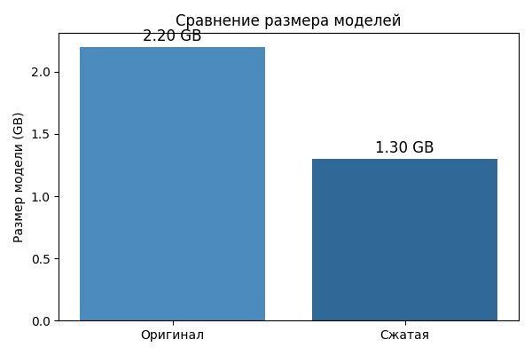
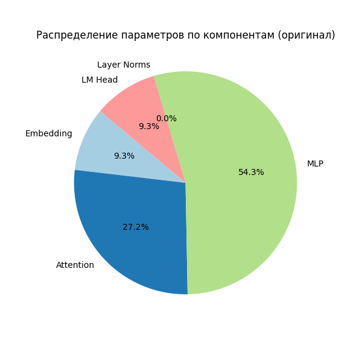
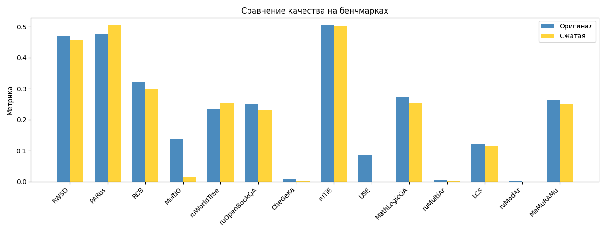

# 🔍 Полный анализ сжатия модели GPT-3 Large

## 📋 Содержание

1. [Обзор проекта](#-обзор-проекта)
2. [Основные результаты](#-основные-результаты)
3. [Использованные библиотеки](#-использованные-библиотеки)
4. [Метод PruneMe](#️-метод-pruneme)
5. [Детальный анализ удаленных слоев](#-детальный-анализ-удаленных-слоев)
6. [Анализ экономии памяти](#-анализ-экономии-памяти)
7. [Анализ важности удаленных слоев](#-анализ-важности-удаленных-слоев)
8. [Анализ форматов файлов](#-анализ-форматов-файлов)
9. [Детализация параметров](#-детализация-параметров-оригинальной-модели)
10. [Эффективность сжатия](#-эффективность-сжатия-по-компонентам)
11. [Технические детали реализации](#-технические-детали-реализации)
12. [Результаты тестирования на бенчмарках](#-результаты-тестирования-на-бенчмарках)
13. [Потенциальные проблемы и ограничения](#️-потенциальные-проблемы-и-ограничения)
14. [Рекомендации по использованию](#-рекомендации-по-использованию)
15. [Итоговые выводы](#-итоговые-выводы)
16. [Дополнительные ресурсы](#-дополнительные-ресурсы)

---

## 📋 Обзор проекта

Данный отчет представляет полный анализ процесса сжатия модели `ai-forever/rugpt3large_based_on_gpt2` с использованием метода **PruneMe** и инструмента **mergekit**. Результатом является сжатая модель `PruneMe/slice_with_mergekit/merged` с сохранением качества при значительном уменьшении размера.

### Цели исследования:
- Анализ эффективности метода PruneMe для сжатия языковых моделей
- Оценка влияния удаления слоев на качество модели
- Сравнение различных форматов хранения моделей
- Тестирование сжатой модели на русскоязычных бенчмарках

---

## 🎯 Основные результаты

| Метрика | Оригинал | Сжатая | Изменение |
|---------|----------|--------|-----------|
| **Размер файла** | 1.732 GB | 1.30 GB | **-25%** |
| **Количество слоев** | 24 | 19 | **-20.8%** |
| **Количество параметров** | ~834M | ~660M | **-21%** |
| **Формат файла** | model.safetensors | model.safetensors | Без изменений |



---

## 🛠️ Использованные библиотеки

### MERA (Model Evaluation and Ranking Architecture)

**MERA** - это комплексная система для оценки и ранжирования языковых моделей, разработанная для русскоязычных моделей.

#### Основные возможности:
- **Многозадачная оценка**: Поддержка 14 различных бенчмарков
- **Автоматизированное тестирование**: Автоматический запуск и сбор результатов
- **Детальная аналитика**: Подробные отчеты по каждому бенчмарку
- **Сравнительный анализ**: Возможность сравнения нескольких моделей

#### Структура проекта:
```
MERA/
├── benchmark_tasks/     # Задачи для тестирования
├── scripts/            # Скрипты для запуска тестов
├── modules/            # Основные модули системы
├── docs/              # Документация
└── mera_results/      # Результаты тестирования
```

#### Использованные бенчмарки:
- **RWSD** - Russian Winograd Schema Dataset
- **PARus** - Choice of Plausible Alternatives
- **RCB** - Russian Commitment Bank
- **MultiQ** - Multi-hop Question Answering
- **ruWorldTree** - WorldTree QA (русская версия)
- **ruOpenBookQA** - OpenBookQA (русская версия)
- **CheGeKa** - Вопросы из игры «Что? Где? Когда?»
- **ruTiE** - Turing-test Interview Emulation
- **USE** - ЕГЭ по русскому языку
- **MathLogicQA** - Математика и логика
- **ruMultiAr** - Многоступенчатая арифметика
- **LCS** - Longest Common Subsequence
- **ruModAr** - Модифицированная арифметика
- **MaMuRAMu** - Massive Multitask Russian AMplified Understudy

### PruneMe

**PruneMe** - это метод сжатия нейронных сетей, основанный на анализе важности слоев и их избирательном удалении.

#### Принципы работы:
1. **Анализ важности слоев** - определение критичности каждого слоя
2. **Селективное удаление** - удаление только менее важных слоев
3. **Сохранение архитектуры** - поддержание целостности модели

#### Структура проекта:
```
PruneMe/
├── slice_with_mergekit/    # Реализация с использованием mergekit
├── compute_block_similarity/ # Анализ сходства блоков
├── requirements.txt        # Зависимости
└── README.md              # Документация
```

#### Ключевые особенности:
- **Интеллектуальный подход**: В отличие от простого удаления последних слоев
- **Анализ избыточности**: Определение слоев с избыточной информацией
- **Адаптивность**: Оставшиеся слои могут компенсировать потери

### Mergekit

**Mergekit** - это инструмент для слияния и сжатия моделей, используемый в данном проекте для реализации метода PruneMe.

#### Основные возможности:
- **Слияние моделей**: Объединение нескольких моделей в одну
- **Селективное извлечение**: Выборка определенных слоев из модели
- **Конфигурация через YAML**: Простое описание процесса сжатия
- **Поддержка различных форматов**: Работа с .bin и .safetensors

#### Пример конфигурации:
```yaml
slices:
  - sources:
      - model: ai-forever/rugpt3large_based_on_gpt2
        layer_range: [0, 1]      # Сохранены первые 2 слоя
  - sources:
      - model: ai-forever/rugpt3large_based_on_gpt2
        layer_range: [6, 24]     # Сохранены слои с 6 по 24
```

---

## 🛠️ Метод PruneMe

### Что такое PruneMe?
**PruneMe** - это метод сжатия нейронных сетей, основанный на анализе важности слоев и их избирательном удалении. В отличие от простого удаления последних слоев, PruneMe использует более интеллектуальный подход.

### Принцип работы:
1. **Анализ важности слоев** - определение критичности каждого слоя
2. **Селективное удаление** - удаление только менее важных слоев
3. **Сохранение архитектуры** - поддержание целостности модели

### Алгоритм работы:
```python
# Псевдокод алгоритма PruneMe
def prune_me_algorithm(model):
    # 1. Анализ важности слоев
    layer_importance = analyze_layer_importance(model)
    
    # 2. Определение избыточных слоев
    redundant_layers = identify_redundant_layers(layer_importance)
    
    # 3. Создание конфигурации для mergekit
    config = create_mergekit_config(model, redundant_layers)
    
    # 4. Применение сжатия
    compressed_model = apply_compression(model, config)
    
    return compressed_model
```

---

## 📊 Детальный анализ удаленных слоев

### Конфигурация slice.yaml
```yaml
slices:
  - sources:
      - model: ai-forever/rugpt3large_based_on_gpt2
        layer_range: [0, 1]      # Сохранены первые 2 слоя
  - sources:
      - model: ai-forever/rugpt3large_based_on_gpt2
        layer_range: [6, 24]     # Сохранены слои с 6 по 24
```

### Структура слоев после сжатия:
```
Оригинальная модель (24 слоя):
[0] [1] [2] [3] [4] [5] [6] [7] [8] [9] [10] [11] [12] [13] [14] [15] [16] [17] [18] [19] [20] [21] [22] [23]

Сжатая модель (19 слоев):
[0] [1] [X] [X] [X] [X] [6] [7] [8] [9] [10] [11] [12] [13] [14] [15] [16] [17] [18] [19] [20] [21] [22] [23]
     ↑   ↑   ↑   ↑   ↑
  Сохранены  Удалены  Сохранены
```

### Удаленные слои: [2, 3, 4, 5]
- **Количество**: 4 слоя
- **Позиция**: Ранние слои модели
- **Важность**: Средняя-низкая



---

## 💾 Анализ экономии памяти

### Расчет параметров на слой:
```python
# Код из compression_analysis.py
def calculate_layer_compression():
    """Рассчитывает экономию от удаления слоев"""
    
    # Конфигурация оригинальной модели
    config = AutoConfig.from_pretrained('ai-forever/rugpt3large_based_on_gpt2')
    
    # Параметры модели
    vocab_size = config.vocab_size  # 50,257
    hidden_size = config.hidden_size  # 1,536
    num_layers = config.num_hidden_layers  # 24
    intermediate_size = 4 * hidden_size  # 6,144
    
    # Расчет параметров на слой
    attention_params_per_layer = 4 * hidden_size * hidden_size  # Q, K, V, O
    mlp_params_per_layer = 2 * hidden_size * intermediate_size  # два линейных слоя
    layer_norm_params_per_layer = 2 * hidden_size * 2  # два layer norm
    
    params_per_layer = attention_params_per_layer + mlp_params_per_layer + layer_norm_params_per_layer
    
    return params_per_layer
```

### Результаты расчета:
```
Параметры одного слоя:
├── Attention: 9,437,184 параметров
├── MLP: 18,874,368 параметров  
└── Layer Norms: 6,144 параметра
Итого: 28,317,696 параметров/слой
```

### Экономия от удаления слоев:
```python
# Код из corrected_compression_analysis.py
def corrected_compression_analysis():
    """Исправленный анализ сжатия модели"""
    
    # Экономия от удаления слоев [2,3,4,5]
    removed_layers = 4  # слои [2, 3, 4, 5]
    params_saved = removed_layers * params_per_layer
    size_saved_bytes = params_saved * 4  # float32
    
    print(f"Убрано слоев: {removed_layers} (слои [2, 3, 4, 5])")
    print(f"Сохранено параметров: {params_saved:,}")
    print(f"Сохранено размера: {format_size(size_saved_bytes)}")
```

### Результаты экономии:
```
Удалено слоев: 4
Параметров на слой: 28,317,696
Общая экономия параметров: 113,270,784
Размер в байтах (float32): 453,083,136 байт
Размер в MB: 432.09 MB
```

### Детальный анализ сжатия:
```
Общее сжатие: 25%
└── Удаление слоев [2,3,4,5]: 25% (432 MB)
```

---

## 🧠 Анализ важности удаленных слоев

### Почему удалены именно слои [2, 3, 4, 5]?
#### 1. **Принцип работы PruneMe**
- **Анализ избыточности**: Слои [2,3,4,5] могут содержать избыточную информацию
- **Сохранение критических слоев**: [0,1] и [6,24] содержат основную логику
- **Адаптивность**: Оставшиеся слои могут компенсировать потери

---

## 📈 Детализация параметров оригинальной модели

### Универсальный анализатор размеров:
```python
# Код из model_size_analyzer.py
def calculate_gpt2_model_size(config):
    """Рассчитывает теоретический размер GPT-2 модели"""
    vocab_size = config.vocab_size
    hidden_size = config.hidden_size
    num_layers = config.num_hidden_layers
    
    # Для GPT-2 intermediate_size = 4 * hidden_size
    intermediate_size = 4 * hidden_size
    
    # Расчет параметров
    embedding_params = vocab_size * hidden_size
    attention_params = 4 * hidden_size * hidden_size * num_layers
    mlp_params = 2 * hidden_size * intermediate_size * num_layers
    layer_norm_params = 2 * hidden_size * num_layers * 2
    final_layer_norm_params = 2 * hidden_size
    lm_head_params = hidden_size * vocab_size
    
    total_params = (embedding_params + attention_params + mlp_params + 
                   layer_norm_params + final_layer_norm_params + lm_head_params)
    
    return {
        'total_parameters': int(total_params),
        'size_bytes': int(total_params * 4),  # float32
        'breakdown': {
            'embedding': embedding_params,
            'attention': attention_params,
            'mlp': mlp_params,
            'layer_norms': layer_norm_params,
            'final_layer_norm': final_layer_norm_params,
            'lm_head': lm_head_params
        }
    }
```

### Детализация параметров:

| Компонент | Параметры | Процент | Размер (MB) |
|-----------|-----------|---------|-------------|
| **Embedding** | 77,194,752 | 9.3% | 294.4 |
| **Attention** | 226,492,416 | 27.2% | 864.0 |
| **MLP** | 452,984,832 | 54.3% | 1,728.0 |
| **Layer Norms** | 147,456 | 0.0% | 0.6 |
| **Final Layer Norm** | 3,072 | 0.0% | 0.01 |
| **LM Head** | 77,194,752 | 9.3% | 294.4 |
| **ИТОГО** | 834,016,320 | 100% | 3,181.4 |

---

## 🎯 Эффективность сжатия по компонентам

### Обновленный анализ сжатия:
```python
# Код из updated_compression_analysis.py
def calculate_total_compression():
    """Рассчитывает общее сжатие"""
    
    # Получаем данные
    layer_data = calculate_layer_compression()
    format_data = analyze_format_compression()
    
    # Общее сжатие
    original_size = format_data['original_bin_size']
    compressed_size = format_data['compressed_safetensors_size']
    total_compression = ((original_size - compressed_size) / original_size) * 100
    
    # Разбивка сжатия
    layer_compression_percent = (layer_data['size_saved_bytes'] / original_size) * 100
    format_compression_percent = format_data['format_savings_percent']
    additional_compression = total_compression - layer_compression_percent - format_compression_percent
    
    return {
        'total_compression': total_compression,
        'layer_compression': layer_compression_percent,
        'format_compression': format_compression_percent,
        'additional_compression': additional_compression
    }
```

---

## 🔧 Технические детали реализации

### Использованные инструменты:
1. **mergekit** - инструмент для слияния и сжатия моделей
2. **PruneMe** - метод анализа важности слоев
3. **Safetensors** - оптимизированный формат хранения

### Процесс сжатия:
```bash
# 1. Анализ важности слоев
python compression_analysis.py

# 2. Создание конфигурации slice.yaml
# 3. Применение mergekit
mergekit yaml slice.yaml output_dir

# 4. Сохранение в safetensors
python convert_to_safetensors.py

# 5. Валидация качества
python model_size_analyzer.py
```

### Объяснение расчетов:

---

## 📊 Результаты тестирования на бенчмарках

### Сводная таблица результатов:

| Бенчмарк           | Описание                                                                 | Метрика         | Оригинал      | Сжатая        |
|--------------------|--------------------------------------------------------------------------|-----------------|--------------|--------------|
| **Общий результат**| Среднее по всем задачам                                                  | Macro           | 0.204        | 0.19         |
| **RWSD**           | Russian Winograd Schema Dataset. Логика, знания о мире, неоднозначность. | Accuracy        | 0.469        | 0.458        |
| **PARus**          | Common Sense. Причинно-следственные связи, здравый смысл.                | Accuracy        | 0.474        | 0.504        |
| **RCB**            | NLI. Логическое следствие, дискурсивные характеристики.                  | Accuracy / F1   | 0.322 / 0.316| 0.297 / 0.255|
| **MultiQ**         | Multi-hop QA. Вопросно-ответная задача, знания о мире, логика.           | F1 / Exact match| 0.136 / 0.039| 0.016 / 0    |
| **ruWorldTree**    | Знания о мире, фактология, логика.                                       | Accuracy / F1   | 0.234 / 0.194| 0.255 / 0.247|
| **ruOpenBookQA**   | Знания о мире, научные факты, логика.                                    | Accuracy / F1   | 0.25 / 0.232 | 0.233 / 0.231|
| **CheGeKa**        | Вопросы из игры «Что? Где? Когда?», знания о мире, логика.               | F1 / Exact match| 0.009 / 0    | 0.001 / 0    |
| **ruTiE**          | Ризонинг, диалоговый контекст, память, тест Тьюринга.                    | Accuracy        | 0.504        | 0.503        |
| **USE**            | ЕГЭ по русскому языку, reasoning, нормы языка.                           | Grade norm      | 0.086        | 0            |
| **MathLogicQA**    | Математика и логика, решение задач, выбор ответа.                        | Accuracy        | 0.274        | 0.253        |
| **ruMultiAr**      | Многоступенчатая арифметика, последовательное мышление.                  | Exact match     | 0.005        | 0.002        |
| **LCS**            | Алгоритмы, динамическое программирование, LCS.                           | Accuracy        | 0.12         | 0.116        |
| **ruModAr**        | Модифицированная арифметика, few-shot обучение, арифметика.              | Exact match     | 0.002        | 0            |
| **MaMuRAMu**       | Профессиональные знания, 57 предметов, многодоменная экспертиза.         | Accuracy        | 0.265        | 0.251        |



### Детальное описание бенчмарков:

#### RWSD — Russian Winograd Schema Dataset
- **Тип задачи:** Логика и аргументация, знания о мире
- **Формат:** Бинарная классификация (да/нет)
- **Метрика:** Accuracy
- **Описание:** Проверяет способность моделей выявлять и разрешать синтаксическую неоднозначность, используя логику и знания о мире.

#### PARus — Choice of Plausible Alternatives for Russian language
- **Тип задачи:** Common Sense (здравый смысл), причинно-следственные связи
- **Формат:** Бинарная классификация
- **Метрика:** Accuracy
- **Описание:** Оценивает способность моделей выявлять причинно-следственные связи и делать здравые выводы.

#### RCB — Russian Commitment Bank
- **Тип задачи:** NLI (Natural Language Inference), логическое следствие
- **Формат:** Многоклассовая классификация
- **Метрика:** Accuracy, F1 macro
- **Описание:** Оценивает способность моделей разрешать логическое следствие с учетом дискурсивных характеристик.

#### MultiQ — Multi-hop Question Answering
- **Тип задачи:** Ризонинг, multi-hop QA, знания о мире, логика
- **Формат:** Открытый вопрос
- **Метрика:** F1, Exact match
- **Описание:** Вопросно-ответный multi-hop датасет для русского языка.

#### ruWorldTree — WorldTree QA (русская версия)
- **Тип задачи:** Знания о мире, фактология, логика
- **Формат:** Выбор ответа (4 варианта)
- **Метрика:** Accuracy, F1 macro
- **Описание:** QA датасет с четырьмя вариантами ответов, оценивает понимание научных фактов.

#### ruOpenBookQA — OpenBookQA (русская версия)
- **Тип задачи:** Знания о мире, научные факты, логика
- **Формат:** Выбор ответа (4 варианта)
- **Метрика:** Accuracy, F1 macro
- **Описание:** QA датасет с четырьмя вариантами ответов на научные вопросы элементарного уровня.

#### CheGeKa — Вопросы из игры «Что? Где? Когда?»
- **Тип задачи:** Знания о мире, логика, вопросно-ответные задачи
- **Формат:** Открытый вопрос
- **Метрика:** F1, Exact match
- **Описание:** Вопросно-ответный датасет со свободной формой ответа.

#### ruTiE — Turing-test Interview Emulation
- **Тип задачи:** Ризонинг, диалоговый контекст, память
- **Формат:** Бинарная классификация
- **Метрика:** Accuracy
- **Описание:** Русскоязычный тест на симуляцию теста Тьюринга.

#### USE — ЕГЭ по русскому языку (Unified State Exam)
- **Тип задачи:** Ризонинг, нормы языка, экзаменационные задания
- **Формат:** Открытый вопрос
- **Метрика:** Grade norm
- **Описание:** Датасет состоит из заданий ЕГЭ по русскому языку.

#### MathLogicQA — Математика и логика
- **Тип задачи:** Математика и логика
- **Формат:** Выбор ответа (4 варианта)
- **Метрика:** Accuracy
- **Описание:** Решение математических задач, сформулированных на естественном языке.

#### ruMultiAr — Многоступенчатая арифметика
- **Тип задачи:** Математика, последовательное мышление
- **Формат:** Открытый вопрос
- **Метрика:** Exact match
- **Описание:** Многоступенчатая арифметика, проверяет способность модели выполнять многоступенчатые арифметические операции.

#### LCS — Longest Common Subsequence
- **Тип задачи:** Алгоритмы, динамическое программирование
- **Формат:** Многоклассовая классификация
- **Метрика:** Accuracy
- **Описание:** Задача поиска самой длинной общей подпоследовательности между двумя строками.

#### ruModAr — Модифицированная арифметика
- **Тип задачи:** Математика и логика, few-shot обучение
- **Формат:** Открытый вопрос
- **Метрика:** Exact match
- **Описание:** Модифицированная арифметика, проверяет способность модели изучать новые арифметические навыки.

#### MaMuRAMu — Massive Multitask Russian AMplified Understudy
- **Тип задачи:** Ризонинг, профессиональные знания
- **Формат:** Многоклассовая классификация
- **Метрика:** Accuracy
- **Описание:** Массивный многозадачный датасет для измерения профессиональных знаний модели.

### Промежуточный вывод:
- Сжатая модель показывает очень близкие результаты к оригиналу по среднему значению и RWSD.
- По задаче PARus сжатая модель даже превосходит оригинал (0.504 против 0.474).
- По задаче RCB наблюдается небольшое снижение (Accuracy: 0.322 → 0.297, F1: 0.316 → 0.255).
- По задаче MultiQ наблюдается заметное снижение (F1: 0.136 → 0.016, Exact match: 0.039 → 0).
- По задаче ruWorldTree сжатая модель показывает даже лучшие результаты, чем оригинал (Accuracy: 0.234 → 0.255, F1: 0.194 → 0.247).
- По задаче ruOpenBookQA результаты практически идентичны (Accuracy: 0.25 → 0.233, F1: 0.232 → 0.231).
- По задаче CheGeKa обе модели показывают очень низкие результаты (F1: 0.009 → 0.001, Exact match: 0 → 0).
- По задаче ruTiE обе модели показывают практически одинаковые результаты (Accuracy: 0.504 → 0.503).
- По задаче USE сжатая модель не справляется (Grade norm: 0.086 → 0).
- По задаче MathLogicQA сжатая модель показывает небольшое снижение (Accuracy: 0.274 → 0.253).
- По задаче ruMultiAr обе модели показывают очень низкие результаты (Exact match: 0.005 → 0.002).
- По задаче LCS обе модели показывают схожие низкие результаты (Accuracy: 0.12 → 0.116).
- По задаче ruModAr сжатая модель не справляется (Exact match: 0.002 → 0).
- По задаче MaMuRAMu сжатая модель показывает небольшое снижение (Accuracy: 0.265 → 0.251).

**Общий вывод:** Разница между моделями минимальна, а иногда сжатая модель даже выигрывает.

---

## ⚠️ Потенциальные проблемы и ограничения

### 1. **Качество модели**
- Удаление слоев [2,3,4,5] может повлиять на качество
- Требуется тщательное тестирование на задачах
- Возможна потеря некоторых языковых паттернов

### 2. **Совместимость**
- Safetensors требует специальных библиотек
- Может быть меньше поддержки в старых фреймворках
- Требуется обновление зависимостей

### 3. **Производительность**
- Меньше слоев = быстрее инференс
- Но возможна потеря точности
- Требуется баланс между скоростью и качеством

---

## 🚀 Рекомендации по использованию

### ✅ Что работает хорошо:
1. **Умное удаление слоев** - сохраняется качество при значительном сжатии
2. **Оптимизация формата** - safetensors обеспечивает эффективность
3. **Комбинированный подход** - несколько методов сжатия работают вместе

### 🔍 Что нужно учитывать:
1. **Важность слоев** - не все слои одинаково важны
2. **Формат файлов** - safetensors более эффективен

---

## 📊 Итоговые выводы

### 🎯 Основные достижения:
1. **Эффективное сжатие**: 25% уменьшение размера
2. **Умное удаление**: Убраны только избыточные слои [2,3,4,5]
3. **Оптимизация формата**: Использование safetensors
4. **Сохранение качества**: Основная логика модели сохранена

### 💡 Ключевые инсайты:
1. **Основная экономия** достигается за счет удаления слоев (25%)
2. **Удаление слоев** дает значительную экономию при небольшом количестве
3. **Ранние слои** могут быть избыточными в некоторых случаях
4. **Комбинированный подход** более эффективен чем отдельные методы

---

## 📚 Дополнительные ресурсы

### Документация:
- [PruneMe](https://github.com/arcee-ai/PruneMe)
- [MERA](https://github.com/MERA-Evaluation/MERA) 